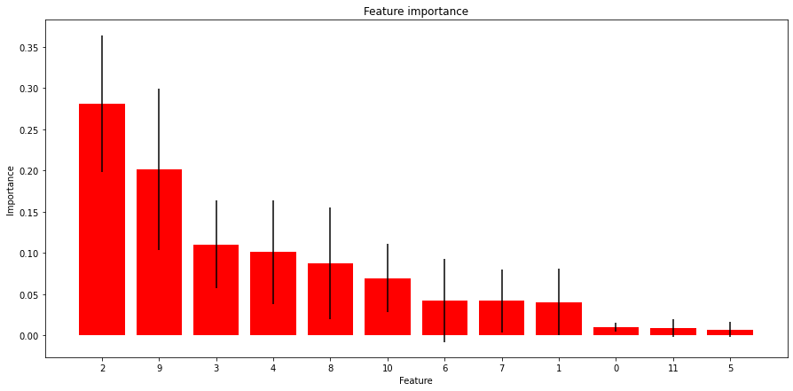

# NYC_property_sales

## Overview

NYC rolling sale data from  April 1 2019 to March 31, 2020
- Data downloaded from [NYC Open Data](https://www1.nyc.gov/site/finance/taxes/property-rolling-sales-data.page)
- Glossary of terms [here](https://www1.nyc.gov/assets/finance/downloads/pdf/07pdf/glossary_rsf071607.pdf)
- NYC building class code description [here](https://www1.nyc.gov/assets/finance/jump/hlpbldgcode.html)
- Zip codes downloaded [here](https://catalog.data.gov/dataset/zip-code-boundaries)

## Codes

|Borough  |Code |
|---------|---- |
|Manhattan|1    |
|Bronx    |2    |
|Brooklyn |3    |
|Queens   |4    |
|Staten Island|5|

## EDA

|Feature ranking|Feature number|Feature name|
|--------------|--------------|------------|
|1             |2             |Block       |
|2             |9             |Gross square feet|
|3             |3             |Lot         |
|4             |4             |Zipcode     |
|5             |8             |Land square feet|
|6             |10            |Year built|
|7             |6             |Commerical units|
|8             |7             |Total units|
|9             |1             |Building Class Category|
|10            |0             |Borough|
|11            |11            |Tax class at time of sale|
|12            |5             |Residential units|  

## Files

nyc-rolling-data.csv
-
NYC_EDA.ipynb
-
NYC_model_puilding.ipynb
-

