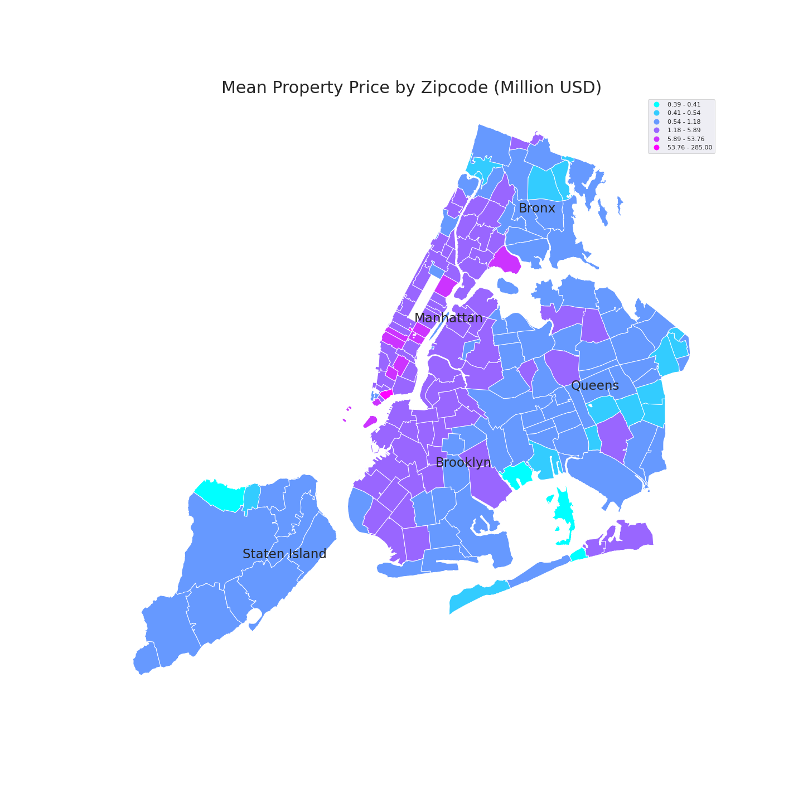

# NYC_property_sales

## Overview
NYC rolling sale data from  April 1 2019 to March 31, 2020
- Data downloaded from [NYC Open Data](https://www1.nyc.gov/site/finance/taxes/property-rolling-sales-data.page)
- Glossary of terms [here](https://www1.nyc.gov/assets/finance/downloads/pdf/07pdf/glossary_rsf071607.pdf)
- NYC building class code description [here](https://www1.nyc.gov/assets/finance/jump/hlpbldgcode.html)
- Zip codes downloaded [here](https://catalog.data.gov/dataset/zip-code-boundaries)

## Files
nyc-rolling-data.csv
-
NYC_EDA.ipynb
-

## Codes

|Borough  |Code |
|---------|---- |
|Manhattan|1    |
|Bronx    |2    |
|Brooklyn |3    |
|Queens   |4    |
|Staten Island|5|

|Tax Class|Description | Tax Rate for Tax Year 2019/2020|
|---------|-----------|--------------------------------|
|1        |One- to three-unit residential properties|21.167%|
|2        | Residential property with more than 3 units including cooperatives & condominiums|  12.473%|
|3        |Most utility property  |12.536%|
|4        |All commercial and industrial properties, such as office, retail, factory buildings and all other properties not included in tax classes 1, 2 or 3. |10.537%|

|Building Class Category| Description|
|-----|----|
